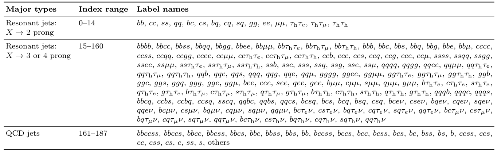
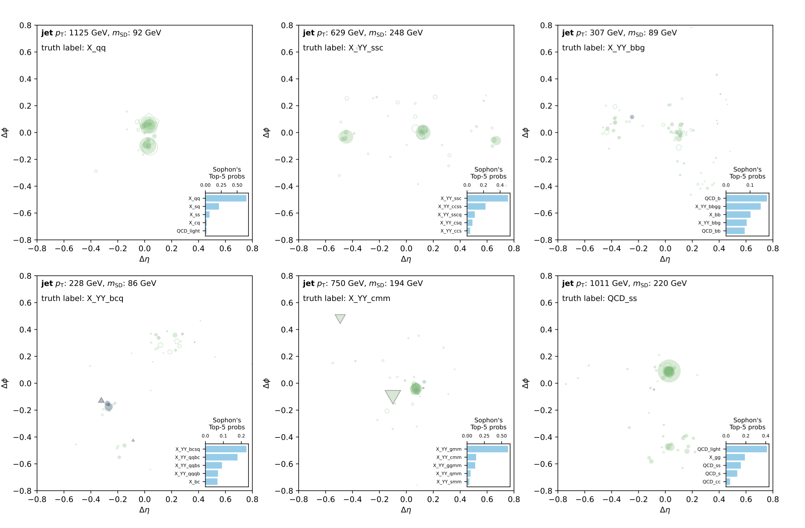

# Sophon

[[Paper]](https://arxiv.org/abs/2405.12972) [[Dataset]]() (TBA) [[Model]](https://huggingface.co/datasets/jet-universe/sophon) [[Colab]](https://colab.research.google.com/github/jet-universe/sophon/blob/main/notebooks/Interacting_with_JetClassII_and_Sophon.ipynb)

**Sophon** (Signature-Oriented Pre-training for Heavy-resonance ObservatioN) is a proposed method for developing foundation AI models tailored for future usage in LHC experimental analyses. The approach focuses on pre-training a model using a comprehensive jet dataset designed to capture extensive jet signatures.

This work introduces:
1. The **JetClass-II** dataset: a large-scale and comprehensive large-*R* jet dataset.
2. The **Sophon model**: a Particle Transformer model pre-trained on a 188-class classification task utilizing the JetClass-II dataset.

Further details are provided below.


## Introduction to JetClass-II

**JetClass-II** is a large-scale and comprehensive dataset covering extensive large-radius jet signatures and a wide range of jet $p_{\rm T}$ and mass values.

The dataset consists of three major parts:
1. **`Res2P`**: Generic $X \to$ 2 prong resonant jets.
2. **`Res34P`**: Generic $X \to$ 3 or 4 prong resonant jets.
3. **`QCD`**: Jets from QCD multijet background.

Each part is further subdivided into detailed categories, indicating which partons, leptons, or combinations thereof initiated the jet.


<!--  -->

The dataset can be downloaded from [[Zenodo]]() (TBA). The three major parts (**`Res2P`**, **`Res34P`**, and **`QCD`**) are separately packed and can be downloaded individually for ease of use. The sizes of the training sets are 20M, 86M, and 28M entries, respectively. The dataset also includes validation and test sets, with the sizes for training/validation/test following a 4:1:1 ratio.

### Data packing

Every 100k entries (jets) are stored in a ROOT file, and every 10 (or in a few cases 5) ROOT files are packaged in a tarball. The name of the tarball contains the range of ROOT file indexes. See the table below for the complete dataset.


| Type | File name range | File number | total entries |
| --- | --- | --- | --- |
| **`Res2P`, train**  | `Res2P_0000.root`—`Res2P_0199.root`   | **200** | **20M**   |
| `Res2P`, val    | `Res2P_0200.root`—`Res2P_0249.root`   | 50  | 5M    |
| `Res2P`, test   | `Res2P_0250.root`—`Res2P_0299.root`   | 50  | 5M    |
| **`Res34P`, train** | `Res34P_0000.root`—`Res34P_0859.root` | **860** | **86M**   |
| `Res34P`, val   | `Res34P_0860.root`—`Res34P_1074.root` | 215 | 21.5M |
| `Res34P`, test  | `Res34P_1075.root`—`Res34P_1289.root` | 215 | 21.5M |
| **`QCD`, train**    | `QCD_0000.root`—`QCD_0279.root`       | **280** | **28M**   |
| `QCD`, val      | `QCD_0280.root`—`QCD_0349.root`       | 70  | 7M    |
| `QCD`, test     | `QCD_0350.root`—`QCD_0419.root`       | 70  | 7M    |


### Quick dive into JetClass-II

Use [[Colab]](https://colab.research.google.com/github/jet-universe/sophon/blob/main/notebooks/Interacting_with_JetClassII_and_Sophon.ipynb) to inspect and visualize data in JetClass-II.

Here are some visualization of jets marked with the top-5 probability scores intepreted by the Sophon model (see the Sophon model's seciton below).



### Generation details

The dataset is generated using MadGraph + Pythia + Delphes. 

During the Delphes (fast simulation) step, the pileup (PU) effect, with an average of 50 PU interactions, is emulated to mimic the realistic LHC collision environment. The PUPPI algorithm is then applied to remove the PU, correcting the E-flow objects used to cluster jets. This distinguishes it from the original JetClass dataset. The Delphes card can be found in the [`jetclass2-generation`](https://github.com/jet-universe/jetclass2_generation) (TBA) repository.

The complete generation script (the one-stop MadGraph + Pythia + Delphes production) and the n-tuplizer script are provided in the [`jetclass2-generation`](https://github.com/jet-universe/jetclass2_generation) repository to facilitate reproducibility.


### Variable details

The JetClass-II dataset includes the following variables:

1. `part_*`: Features for jet constituent particles (i.e., E-flow objects in Delphes).
2. `jet_*`: Features for jets. A specific variable is `jet_label`, which indicates the label in 188 classes.
3. `genpart_*`: Features for generator-level jet (GEN-jet) constituent particles. The GEN-jet is clustered from the stable particles generated by Pythia, excluding neutrinos, using the same clustering configuration. The GEN-jets are matched with jets based on angular separation. The entry is left empty if no matched GEN-jet is found.
4. `genjet_*`: Jet-level features for the matched GEN-jet.
5. `aux_genpart_*`: Auxiliary variables storing features of selected truth particles. Five types of particles are chosen if they are valid:
    1. The initial resonance $X$ (in both 2-prong and 3/4-prong resonance cases).
    2. The two secondary resonances $Y$ produced by $X$ ($X \to Y_1Y_2$) in the 3/4-prong resonance case.
    3. The direct decay products (partons and leptons) from $X$ and $Y$.
    4. The subsequent decay products of tau leptons in case (iii).
    5. The partons ($p_{\rm T}$ > 5 GeV) matched within a QCD jet.

<details>
  <summary>**Expand to see detailed descriptions for JetClass-II variables and a comparison with JetClass variables.**</summary>
  
| Variable | Type | Description | Exists in JetClass? |
| --- | --- | --- | --- |
| **For jet constituent particles** | | | |
| `part_px`              | vector\<float\>       | particle's $p_x$ | ✔️
| `part_py`              | vector\<float\>       | particle's $p_y$ | ✔️
| `part_pz`              | vector\<float\>       | particle's $p_z$ | ✔️
| `part_energy`          | vector\<float\>       | particle's energy | ✔️
| `part_deta`            | vector\<float\>       | difference in pseudorapidity $\eta$ between the particle and the jet axis | ✔️
| `part_dphi`            | vector\<float\>       | difference in azimuthal angle $\phi$ between the particle and the jet axis | ✔️
| `part_d0val`           | vector\<float\>       | particle's transverse impact parameter value $d_0$, in mm | ✔️
| `part_d0err`           | vector\<float\>       | error of the particle's transverse impact parameter $\sigma_{d_0}$, in mm | ✔️
| `part_dzval`           | vector\<float\>       | particle's longitudinal impact parameter value $d_z$, in mm | ✔️
| `part_dzerr`           | vector\<float\>       | error of the particle's longitudinal impact parameter $\sigma_{d_z}$, in mm | ✔️
| `part_charge`          | vector\<int32_t\>     | particle's electric charge | ✔️
| `part_isElectron`      | vector\<bool\>        | if the particle is an electron (`abs(pid)==11`) | ✔️
| `part_isMuon`          | vector\<bool\>        | if the particle is an muon (`abs(pid)==13`) | ✔️
| `part_isPhoton`        | vector\<bool\>        | if the particle is an photon (`pid==22`) | ✔️
| `part_isChargedHadron` | vector\<bool\>        | if the particle is a charged hadron (`charge!=0 && !isElectron && !isMuon`) | ✔️
| `part_isNeutralHadron` | vector\<bool\>        | if the particle is a neutral hadron (`charge==0 && !isPhoton`) | ✔️
| **For jet** | | | |
| `jet_pt`               | float                 | jet's transverse momentum $p_{\rm T}$ | ✔️
| `jet_eta`              | float                 | jet's pseudorapidity $\eta$ | ✔️
| `jet_phi`              | float                 | jet's azimuthal angle $\phi$ | ✔️
| `jet_energy`           | float                 | jet's energy | ✔️
| `jet_sdmass`           | float                 | jet's soft-drop mass | ✔️
| `jet_nparticles`       | int32_t               | number of jet constituent particles | ✔️
| `jet_tau1`             | float                 | jet's $N$-subjettiness variable $\tau_1$ | ✔️
| `jet_tau2`             | float                 | jet's $N$-subjettiness variable $\tau_2$ | ✔️
| `jet_tau3`             | float                 | jet's $N$-subjettiness variable $\tau_3$ | ✔️
| `jet_tau4`             | float                 | jet's $N$-subjettiness variable $\tau_4$ | ✔️
| `jet_label`            | int32_t               | jet's label index in JetClass-II, detailed in the above table | New
| **For GEN-jet constituent particles** (if a GEN-jet is found matched to a jet) | | | |
| `genpart_px`           | vector\<float\>       | particle's $p_x$ | New
| `genpart_py`           | vector\<float\>       | particle's $p_y$ | New
| `genpart_pz`           | vector\<float\>       | particle's $p_z$ | New
| `genpart_energy`       | vector\<float\>       | particle's energy | New
| `genpart_jet_deta`     | vector\<float\>       | difference in pseudorapidity $\eta$ between the particle and the jet (not the GEN-jet) axis | New
| `genpart_jet_dphi`     | vector\<float\>       | difference in azimuthal angle $\phi$ between the particle and the jet (not the GEN-jet) axis | New
| `genpart_x`            | vector\<float\>       | $x$ coordinate of the particle’s production vertex, in mm | New
| `genpart_y`            | vector\<float\>       | $y$ coordinate of the particle’s production vertex, in mm | New
| `genpart_z`            | vector\<float\>       | $z$ coordinate of the particle’s production vertex, in mm | New
| `genpart_t`            | vector\<float\>       | $t$ coordinate of the particle’s production vertex, in mm/c | New
| `genpart_pid`          | vector\<int32_t\>     | particle’s PDGID | New
| **For GEN-jet** (if matched to a jet) | | | |
| `genjet_pt`            | float                 | GEN-jet's transverse momentum $p_{\rm T}$ | New
| `genjet_eta`           | float                 | GEN-jet's pseudorapidity $\eta$ | New
| `genjet_phi`           | float                 | GEN-jet's azimuthal angle $\phi$ | New
| `genjet_energy`        | float                 | GEN-jet's energy | New
| `genjet_sdmass`        | float                 | GEN-jet's soft-drop mass | New
| `genjet_nparticles`    | int32_t               | number of GEN-jet constituent particles | New
| **For selected truth particles** | | | |
| `aux_genpart_pt`       | vector\<float\>       | selected truth particles' $p_{\rm T}$ | ✔️ (different rules to select truth particles)
| `aux_genpart_eta`      | vector\<float\>       | selected truth particles' $\eta$ | ✔️ (different rules to select truth particles)
| `aux_genpart_phi`      | vector\<float\>       | selected truth particles' $\phi$ | ✔️ (different rules to select truth particles)
| `aux_genpart_mass`     | vector\<float\>       | selected truth particles' mass | ✔️ (different rules to select truth particles)
| `aux_genpart_pid`      | vector\<int32_t\>     | selected truth particles' PDGID | New
| `aux_genpart_isResX`   | vector\<bool\>        | if the particle is the initial resonance $X$ | New
| `aux_genpart_isResY`   | vector\<bool\>        | if the particle is the secondary resonance $Y$ | New
| `aux_genpart_isResDecayProd` | vector\<bool\>  | if the particle is the direct decay product (parton and lepton) from $X$ and $Y$ | New
| `aux_genpart_isTauDecayProd` | vector\<bool\>  | if the particle is the subsequent decay product of tau leptons | New
| `aux_genpart_isQcdParton`    | vector\<bool\>  | if the particle is the parton with $p_{\rm T}$ > 5 GeV stored in the QCD jet case | New

</details>


## Pre-training Sophon model

### Install dependencies

The Sophon model is based on the [ParT](https://github.com/jet-universe/particle_transformer) architecture. It is implemented in PyTorch, with training based on the [weaver](https://github.com/hqucms/weaver-core) framework for dataset loading and transformation. To install `weaver`, run:

```bash
pip install git+https://github.com/hqucms/weaver-core.git@dev/custom_train_eval
```

 > **Note:** We are temporarily using a development branch of `weaver`.

For instructions on setting up Miniconda and installing PyTorch, refer to the [`weaver`](https://github.com/hqucms/weaver-core?tab=readme-ov-file#set-up-a-conda-environment-and-install-the-packages) page.

### Download dataset

Download the JetClass-II dataset from [[Zenodo]]() (TBA) and ensure that all ROOT files are accessible from:

```bash
./datasets/JetClassII/Pythia/{Res2P,Res34P,QCD}_*.root
```

The required data files for training and validation is shown in the [table](#data-packing). The test data is not used in this work.

### Training

**Step 1:** Generate dataset sampling weights according to the `weights` section in the data configuration. The processed config with pre-calculated weights will be saved to `data/JetClassII`.

```bash
./train_sophon.sh make_weight
```

**Step 2:** Start training.

```bash
./train_sophon.sh train
```

 > **Note:** Depending on your machine and GPU configuration, additional settings may be useful. Here are a few examples:
 > - Enable PyTorch's DDP for parallel training, e.g., `CUDA_VISIBLE_DEVICES=0,1,2,3 DDP_NGPUS=4 ./train_sophon.sh train --start-lr 2e-3` (the learning rate should be scaled according to `DDP_NGPUS`).
 > - Configure the number of data loader workers, the fetch step for loading each ROOT file, and the dataset split number to alleviate memory burden. Example command: `./train_sophon.sh train --num-workers 8 --fetch-step 0.02 --data-split-num 4`.

**Step 3** (optional): Convert the model to ONNX.

```bash
./train_sophon.sh convert
```

## Using Sophon model (Python/C++)

We introduce two methods for inferring the Sophon model: using Python and C++ (with C++ macros for analyzing Delphes files).

### Python workflow

Please refer to our Jupyter notebook example on [[Colab]](https://colab.research.google.com/github/jet-universe/sophon/blob/main/notebooks/Interacting_with_JetClassII_and_Sophon.ipynb) for detailed instructions. See the section "Inferring Sophon model" for more information.

### C++ workflow for analyzing Delphes files

For details on using the C++ workflow, please see the [`./analyzers`](./analyzers) directory.


## Citation

If you use the JetClass-II dataset or the Sophon model, please cite:

```
@article{Li:2024htp,
    author = "Li, Congqiao and Agapitos, Antonios and Drews, Jovin and Duarte, Javier and Fu, Dawei and Gao, Leyun and Kansal, Raghav and Kasieczka, Gregor and Moureaux, Louis and Qu, Huilin and Suarez, Cristina Mantilla and Li, Qiang",
    title = "{Accelerating Resonance Searches via Signature-Oriented Pre-training}",
    eprint = "2405.12972",
    archivePrefix = "arXiv",
    primaryClass = "hep-ph",
    month = "5",
    year = "2024"
}

@dataset{JetClassII,
    author       = "Li, Congqiao and Agapitos, Antonios and Drews, Jovin and Duarte, Javier and Fu, Dawei and Gao, Leyun and Kansal, Raghav and Kasieczka, Gregor and Moureaux, Louis and Qu, Huilin and Suarez, Cristina Mantilla and Li, Qiang",
    title        = "...",
    month        = "...",
    year         = "...",
    publisher    = "Zenodo",
    version      = "1.0.0",
    doi          = "...",
    url          = "..."
}
```
